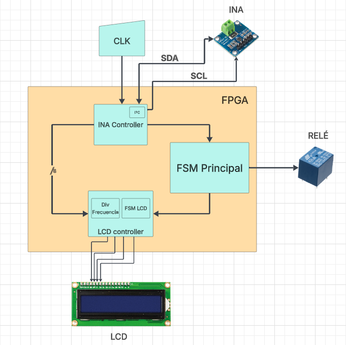
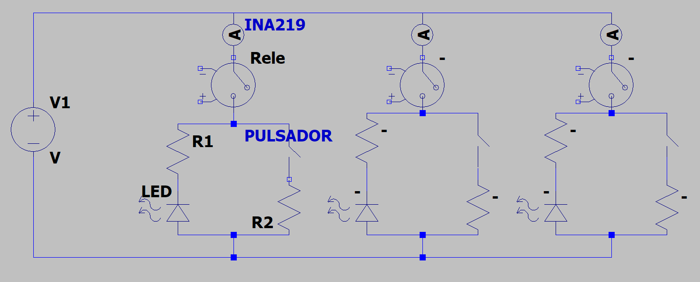
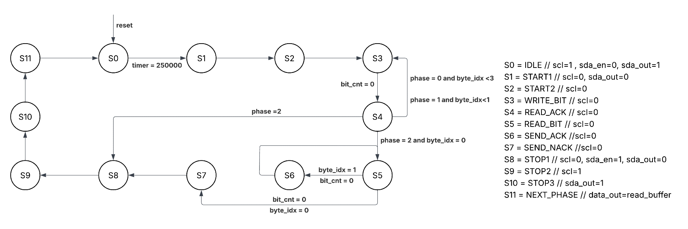
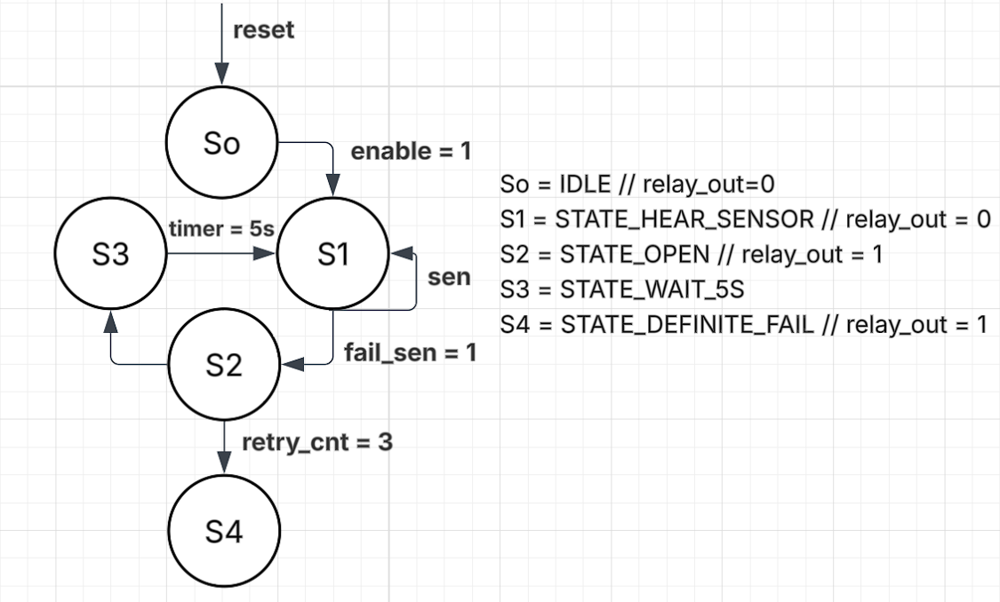

# Proyecto final - Electrónica Digital 1 - 2025-II

# Integrantes
- [Abishek Arunachalam](https://github.com/Abishek957951)
- [Juan David Delgado Africano](https://github.com/JuanDaDel)
- [Johan Sebastian Beltran Hernandez](https://github.com/johanb1306)

# Scutum

Este proyecto se enfoca en la detección y protección ante fallas por sobre-corrientes con la ayuda de sensores *INA219* y *relés* implementados en un circuito en pequeña escala. 

# Documentación

## Descripción de la arquitectura
La descripción se encuentra debidamente comentada.

## Diagramas de la arquitectura 

### Diagrama de bloques

### Circuito Implementado

###  FSM INA Controller

### FSM Relés

## Simulaciones

## Evidencias de implementación

En los siguintes video se evidencia el proyecto funcionando:
- [Ver.1](https://drive.google.com/file/d/1Mmljcazj2t6dFqfmwmpv4hNdylavXCxc/view?usp=sharing)
- [Ver.2](https://drive.google.com/file/d/1lYLRodQK6aysjbRK7mQdx4uk0jrV_N0d/view?usp=sharing)

